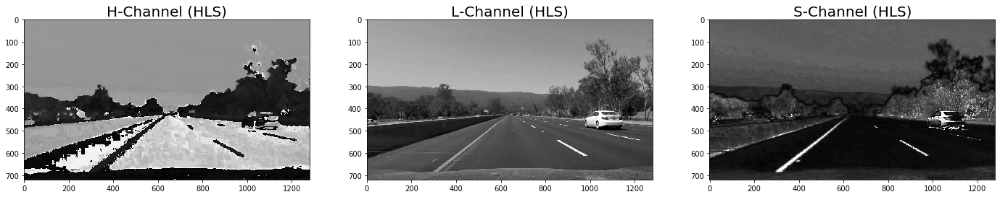
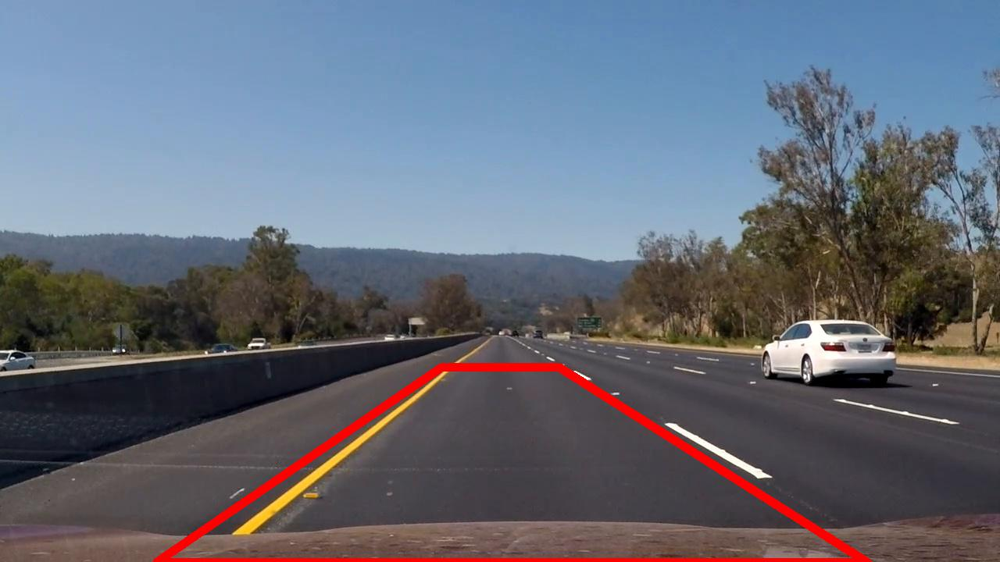
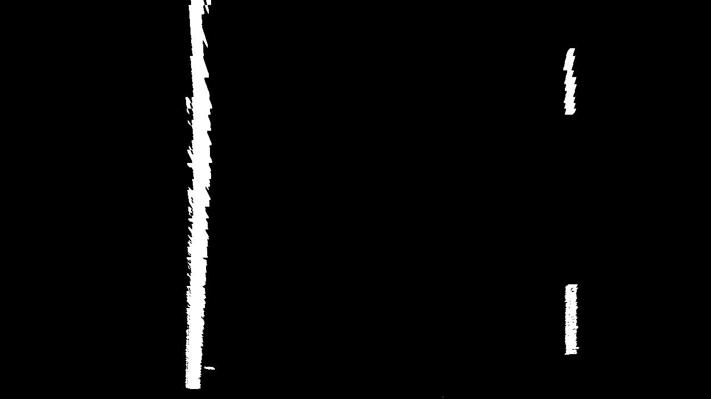
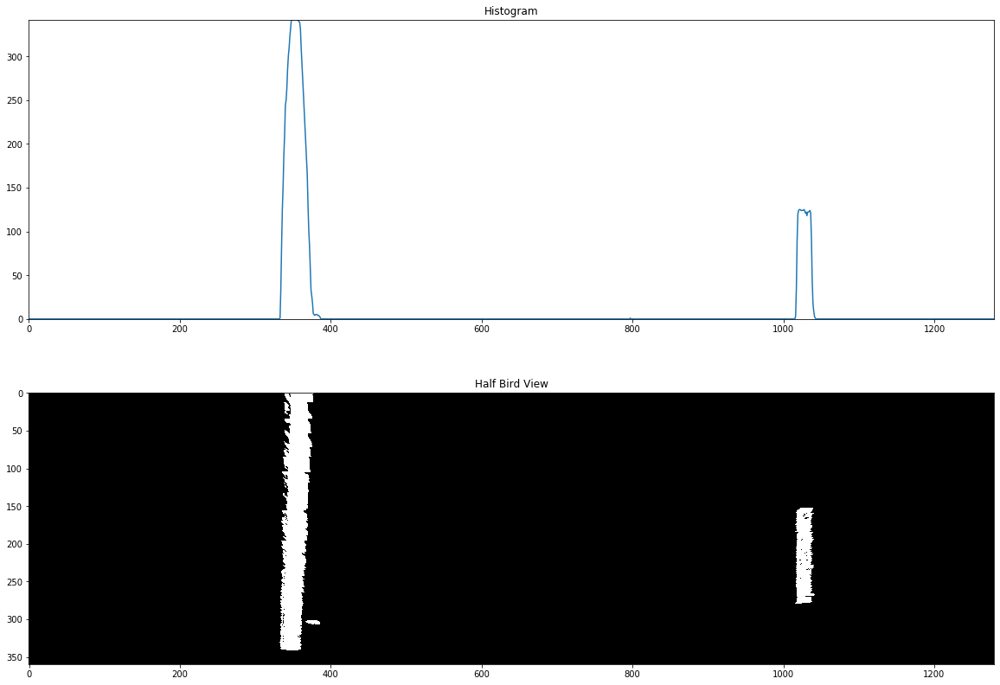

## Udacity SDC (Self-Driving Car): Advanced Lane Finding

### Introduction ###

In this project, the objetive is to create a pipeline, using advanced computer vision techniques, to find lane lines in the road in a video. The result expected should be like the following image:


To get the above results, we need to take present the following criteria:

- Calibrate the camera: to compute the camera matrix and distrtion coefficients.
- Distortion Correction Image: usign the parameters obtained on Calibration Camera.
- Identify Color Transforms: To obtain the lane pixels from images.
- Make a Perspective Transform: Rectify each image to a "bird eye view".
- Identify left and right lane lines and fit with a curved functional form.
- Calculate the radious of curvature.
- Apply line finding on video: based on result from images, implement the final pipeline in the video.

## Developing the pipeline ###
Before starting the algorithm to identify the line lanes on the images or video, we need to consider that the elements captured from camera needs a correction due a distortion caused by the camera lens. This require the camera calibration

### Camera Calibration ###
The objective of this step is to prepare the variables required to get the camera matrix using the following functions from opencv (check [pipeline](Pipeline.ipynb)):

``` python3
## nx = 9, ny = 6
objp = np.zeros((nx*ny,3), np.float32)
objp[:,:2] = np.mgrid[0:nx, 0:ny].T.reshape(-1,2)

## ... calculate and save objpoints and imgpoints, using glob
objpoints = [] # 3d points in real world space
imgpoints = [] # 2d points in image plane.

images = glob.glob('camera_cal/calibration*.jpg')
n_it = len(images)

for i in range(n_it):
    img = cv2.imread(images[i])
    gray = cv2.cvtColor(img, cv2.COLOR_BGR2GRAY)
    
    # Find the chessboard corners
    ret, corners = cv2.findChessboardCorners(gray, (nx,ny), None)
    
    if ret == True:
        # append objp and corners
        objpoints.append(objp)
        imgpoints.append(corners)
```

The last script, is a lite version of the original one, that will be used to get the camera matrix using the following method from opencv:

```python3
ret, mtx, dist, rvecs, tvecs = cv2.calibrateCamera(objpoints, imgpoints, img.shape[0:2], None, None)
```

## Distortion Correction Image ##

In the [pipeline](Pipeline.ipynb), we use all the images stored in [camera_cal](./camera_cal) to get all ```object_points``` and ```image_points```, after obtain this information we use the following method to unidistor image, based on the camera matrix:

```python
def cal_undistort(img, objpoints, imgpoints):
    ret, mtx, dist, rvecs, tvecs = cv2.calibrateCamera(objpoints, imgpoints, img.shape[0:2], None, None)
    
    dst = cv2.undistort(img, mtx, dist, None, mtx)
    return dst, mtx, dist
```

The following image is used to do the distortion correction:


We obtain the following result:


## Identify Color Transforms ##
Lets print all the rgb channels for a image taken in the lane lines context.

The following image will be used to identify the color transforms:


The RGB channels printed as gray scale each one looks like this:


In the HLS space, each channel printed as gray scale looks like this:



In the HSV space, each channel printed as gray scale looks like this:


Based in the results, the S channel from HLS should be a good option, because it have a high contrast with the lines and background.

Applying sobel operation in x direction to the selected channel with the following method:
```
def sobel_x(img):
    sobel = cv2.Sobel(gray, cv2.CV_64F, 1, 0)
    abs_sobel = np.absolute(sobel)
    scaled_sobel = np.uint8(255*abs_sobel/np.max(abs_sobel))
    return scaled_sobel
```
The result is:


the last method was modified, to return a binary image:
```
def sobel_x_binary(img, thresh_min, thresh_max):
    sobel = cv2.Sobel(gray, cv2.CV_64F, 1, 0)
    abs_sobel = np.absolute(sobel)
    scaled_sobel = np.uint8(255*abs_sobel/np.max(abs_sobel))

    sxbinary = np.zeros_like(scaled_sobel)
    sxbinary[(scaled_sobel >= thresh_min) & (scaled_sobel <= thresh_max)] = 1
    return sxbinary
```

with the following parameters:

```
thresh_min = 20
thresh_max = 200
```

The result obtained is:


Another analisys was to implement a threshold in the same selected channel, with the following method:
```
def binary(img, thresh_min, thresh_max):
    binary = np.zeros_like(scaled_sobel)
    binary[(img >= thresh_min) & (img <= thresh_max)] = 1
    return binary
```

And its implementation:
```
b_image = binary(selected_channel, 120, 255)
```

The result is:


# Make a Perspective Transform ##
To make a perspective transform, the points are selected similar to the region of interest made in the previous project, so we use the following function made and its implementation as a reference:

```
def region_of_interest(img, vertices):
    mask = np.zeros_like(img)   
    
    if len(img.shape) > 2:
        channel_count = img.shape[2]  # i.e. 3 or 4 depending on your image
        ignore_mask_color = (255,) * channel_count
    else:
        ignore_mask_color = 255
    cv2.fillPoly(mask, vertices, ignore_mask_color)

    masked_image = cv2.bitwise_and(img, mask)
    return masked_image

(height, width) = sxbinary.shape
## Region of interest
mid_offset = 100
left_bottom = [mid_offset, height]
right_bottom = [width, height]
apex = [((width+100)//2)-mid_offset, 460]
apex2 = [((width+100)//2)+mid_offset, 460]
corners = [left_bottom, right_bottom, apex2, apex]
area = np.array( [corners], dtype=np.int32 )
img_region = region_of_interest(sxbinary, area)
```
The following code is used to check the regions that we want to check for our perspective trasnform:

```
(height, width) = img_lane.shape[:2]
mid_offset = 105
bottom_offset = 220
x_offset = -20

left_bottom = (0 + bottom_offset + x_offset, height)
right_bottom = (width - bottom_offset + x_offset + 70, height)
apex = (((width+100)//2)-mid_offset + x_offset, 470)
apex2 = (((width+100)//2)+mid_offset + x_offset - 60, 470)
corners = [left_bottom, right_bottom, apex2, apex]

def draw_region(img, vertices):
    line_color = (255, 0, 0)
    thickness = 9
    
    image = np.copy(img)
    
    image = cv2.line(image, vertices[0], vertices[1], line_color, thickness)
    image = cv2.line(image, vertices[1], vertices[2], line_color, thickness)
    image = cv2.line(image, vertices[2], vertices[3], line_color, thickness)
    image = cv2.line(image, vertices[3], vertices[0], line_color, thickness)
    return image

rgb_lane_lines = cv2.cvtColor(img_lane, cv2.COLOR_BGR2RGB)
img_region_lines = draw_region(rgb_lane_lines, corners)
```

The result is:


The ```corners``` variable from the last script is used to get a perspective transform. We define the following function to get `bird_view` transformation:

```
def bird_view(img, corners):
    offset = 50 # offset for dst points
    img_size = (img.shape[1], img.shape[0])

    src_points = np.float32(corners)

    dst_points = np.float32([[offset, offset], [img_size[0]-offset, offset], 
                                 [img_size[0]-offset, img_size[1]-offset], 
                                 [offset, img_size[1]-offset]])

    M = cv2.getPerspectiveTransform(src_points, dst_points)
    M_inv = cv2.getPerspectiveTransform(dst_points, src_points)
    warped = cv2.warpPerspective(img, M, img_size)
    return warped, M, M_inv

bird_view, M, M_inv = bird_view(img_region, corners[::-1])
```

The result after implement ```bird_view``` function on the binary image is:


## Identify left and right lane lines ##
At htis point the perspective and binary transformations shows a nice job.
Using the half image from bird view, with the following code, the peaks asociated with the left and right lane are visible in the histogram:

```
def _lr_peaks_histogram(img):
    bottom_half = img[img.shape[0]//2:,:]
    histogram = np.sum(bottom_half, axis=0)
    return histogram, bottom_half

histogram, bottom_half = _lr_peaks_histogram(bird_view)
```



## Calculate the radious of curvature

To calculate the radious of curvature, we use the sliding window algorith, to identify pixel that are part of the lane lines (The function is large, so you can found in [Pipeline](Pipeline.ipynb) file).


The following image is a combination of differents funcions that use the calculated points in the sliding window with the previous polinomial fit values.


The functions called are:
```python
def fit_poly(img_shape, leftx, lefty, rightx, righty):
    left_fit = np.polyfit(lefty, leftx, 2)
    right_fit = np.polyfit(righty, rightx, 2)
    # Generate x and y values for plotting
    ploty = np.linspace(0, img_shape[0]-1, img_shape[0])
    ### Calc both polynomials using ploty, left_fit and right_fit ###
    left_fitx = left_fit[0]*ploty**2 + left_fit[1]*ploty + left_fit[2]
    right_fitx = right_fit[0]*ploty**2 + right_fit[1]*ploty + right_fit[2]
    
    return left_fitx, right_fitx, ploty

def search_around_poly(binary_warped):
    margin = 100

    # Grab activated pixels
    nonzero = binary_warped.nonzero()
    nonzeroy = np.array(nonzero[0])
    nonzerox = np.array(nonzero[1])
    
    # Using the +/- margin of our polynomial function #
    l_lane_inds = ((nonzerox > (left_fit[0]*(nonzeroy**2) + left_fit[1]*nonzeroy + 
                    left_fit[2] - margin)) & (nonzerox < (left_fit[0]*(nonzeroy**2) + 
                    left_fit[1]*nonzeroy + left_fit[2] + margin)))
    r_lane_inds = ((nonzerox > (right_fit[0]*(nonzeroy**2) + right_fit[1]*nonzeroy + 
                    right_fit[2] - margin)) & (nonzerox < (right_fit[0]*(nonzeroy**2) + 
                    right_fit[1]*nonzeroy + right_fit[2] + margin)))
    
    # Extract left and right line pixel positions
    leftx = nonzerox[l_lane_inds]
    lefty = nonzeroy[l_lane_inds] 
    rightx = nonzerox[r_lane_inds]
    righty = nonzeroy[r_lane_inds]

    # Fit new polynomials
    left_fitx, right_fitx, ploty = fit_poly(binary_warped.shape, leftx, lefty, rightx, righty)
    
    # Create an image to draw on and an image to show the selection window
    out_img = np.dstack((binary_warped, binary_warped, binary_warped))*255
    window_img = np.zeros_like(out_img)
    # Color in left and right line pixels
    out_img[nonzeroy[l_lane_inds], nonzerox[l_lane_inds]] = [255, 0, 0]
    out_img[nonzeroy[r_lane_inds], nonzerox[r_lane_inds]] = [0, 0, 255]
    
    # Generate a polygon to illustrate the search window area
    # And recast the x and y points into usable format for cv2.fillPoly()
    left_line_window1 = np.array([np.transpose(np.vstack([left_fitx-margin, ploty]))])
    
    left_line_window2 = np.array([np.flipud(np.transpose(np.vstack([left_fitx+margin, ploty])))])
    
    left_line_pts = np.hstack((left_line_window1, left_line_window2))
    
    right_line_window1 = np.array([np.transpose(np.vstack([right_fitx-margin, ploty]))])
    
    right_line_window2 = np.array([np.flipud(np.transpose(np.vstack([right_fitx+margin, ploty])))])
    
    right_line_pts = np.hstack((right_line_window1, right_line_window2))

    # Draw the lane onto the warped blank image
    cv2.fillPoly(window_img, np.int_([left_line_pts]), (0,255, 0))
    cv2.fillPoly(window_img, np.int_([right_line_pts]), (0,255, 0))
    result = cv2.addWeighted(out_img, 1, window_img, 0.3, 0)
    
    # Plot the polynomial lines onto the image
    plt.plot(left_fitx, ploty, color='yellow')
    plt.plot(right_fitx, ploty, color='yellow')
    
    return result
```


## Final pipeline ##
The final pipeline is created in [`final_implementation.py`](./final_implementation.py) file. There, each step was wrapped and improved in a function inside a class named LanesProcessing, encapsulating and improving the implementations made before. Each step was assigned in a function in the mentioned class, and tested with the [`final_implementation.ipynb`](./final_implementation.ipynb) notebook. The final result, using a frame of the project video is:


The implementation in the video can be found in [`final_implementation.py`](./final_implementation.py) in the `main` function:

```python
def main():
    # Lane processing object
    processing = LanesProcessing('camera_cal/calibration*.jpg')

    # Path to the clip input
    video_input = './videos/project_video.mp4'
    # Path to the clip output
    video_output = './videos/output_vid.mp4'

    clip1 = VideoFileClip(video_input)

    # This operation expects 3-channel images
    vid_clip = clip1.fl_image(lambda frame: processing.process_image(frame))
    vid_clip.write_videofile(video_output, audio=False)
```

The video result can be found as `output_vid.mp4` in [`videos/`](videos/) folder.


