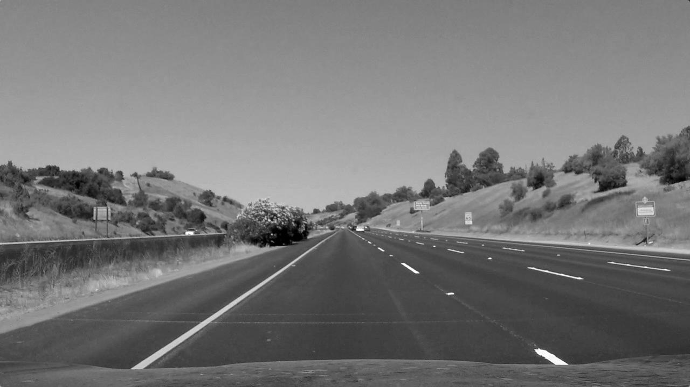
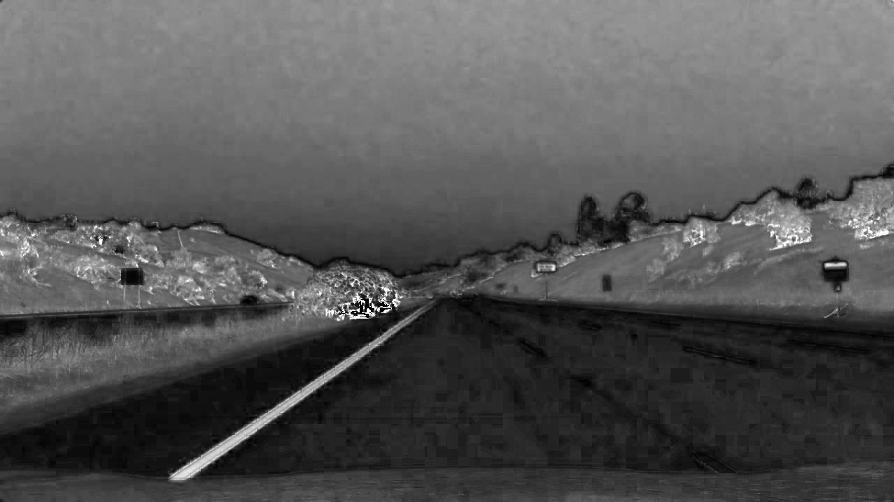

## Udacity SDC (Self-Driving Car): Advanced Lane Finding

### Introduction ###

In this project, the objetive is to create a pipeline, using advanced computer vision techniques, to find lane lines in the road a video. The result expected should be like the following image:


To get the above results, we need to take present the following criteria:

- Calibrate the camera: to compute the camera matrix and distrtion coefficients.
- Distortion Correction Image: usign the parameters obtained on Calibration Camera.
- Identify Color Transforms: To obtain the lane pixels from images.
- Make a Perspective Transform: Rectify each image to a "bird eye view".
- Identify left and right lane lines and fit with a curved functional form.
- Calculate the radious of curvature.
- Apply line finding on video: based on result from images, implement the final pipeline in the video.

## Developing the pipeline ###
Before starting the algorithm to identify the line lanes on the images or video, we need to consider that the elements captured from camera needs a correction due a distortion caused by the camera lens. This require the camera calibration

### Camera Calibration ###
The objective of this step is to prepare the variables required to get the camera matrix using the following functions from opencv (check [pipeline](Pipeline.ipynb)):

``` python3
## nx = 9, ny = 6
objp = np.zeros((nx*ny,3), np.float32)
objp[:,:2] = np.mgrid[0:nx, 0:ny].T.reshape(-1,2)

## ... calculate and save objpoints and imgpoints, using glob
objpoints = [] # 3d points in real world space
imgpoints = [] # 2d points in image plane.

images = glob.glob('camera_cal/calibration*.jpg')
n_it = len(images)

for i in range(n_it):
    img = cv2.imread(images[i])
    gray = cv2.cvtColor(img, cv2.COLOR_BGR2GRAY)
    
    # Find the chessboard corners
    ret, corners = cv2.findChessboardCorners(gray, (nx,ny), None)
    
    if ret == True:
        # append objp and corners
        objpoints.append(objp)
        imgpoints.append(corners)
```

The last script, is a lite version of the original one, that will be used to get the camera matrix using the following method from opencv:

```python3
ret, mtx, dist, rvecs, tvecs = cv2.calibrateCamera(objpoints, imgpoints, img.shape[0:2], None, None)
```

## Distortion Correction Image ##

In the [pipeline](Pipeline.ipynb), we use all the images stored in [camera_cal](./camera_cal) to get all ```object_points``` and ```image_points```, after obtain this information we use the following method to unidistor image, based on the camera matrix:

```python
def cal_undistort(img, objpoints, imgpoints):
    ret, mtx, dist, rvecs, tvecs = cv2.calibrateCamera(objpoints, imgpoints, img.shape[0:2], None, None)
    
    dst = cv2.undistort(img, mtx, dist, None, mtx)
    return dst, mtx, dist
```

The following image is used to do the distortion correction:


We obtain the following result:


## Identify Color Transforms ##
Lets print all the rgb channels for a image taken in the lane lines context.

The following image will be used to identify the color transforms:


The RGB channels printed as gray scale looks like this:

- Red channel:


- Green channel:


- Blue channel:


Lets move to another color space.

In the HLS space, each channel printed as gray scale looks like this:
- H channel:


- L channel:


- S channel:


In the HSV space, each channel printed as gray scale looks like this:
- H channel:


- S channel:


- V channel:


Based in the results, the S channel from HLS should be a good option, because it have a high contrast with the lines and background.

Applying sobel operation in x direction to the selected channel, have the following result:

## Identify Color Transforms ##


## How to write a README
A well written README file can enhance your project and portfolio.  Develop your abilities to create professional README files by completing [this free course](https://www.udacity.com/course/writing-readmes--ud777).

